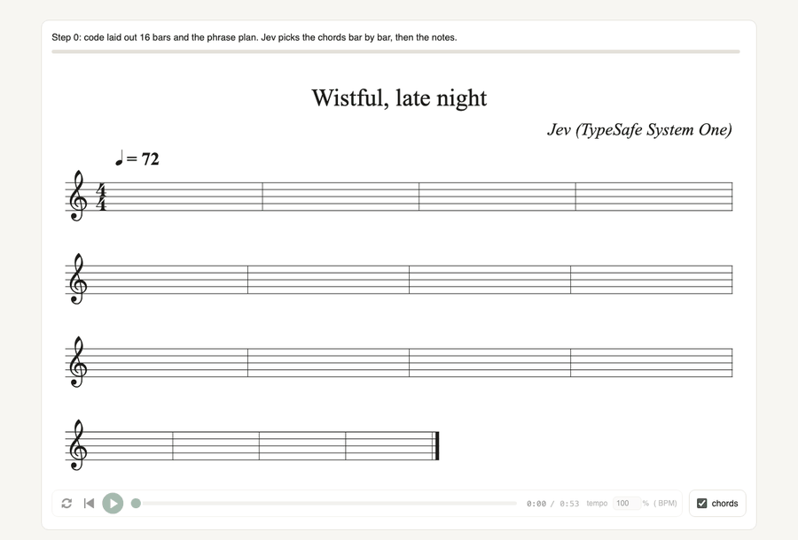
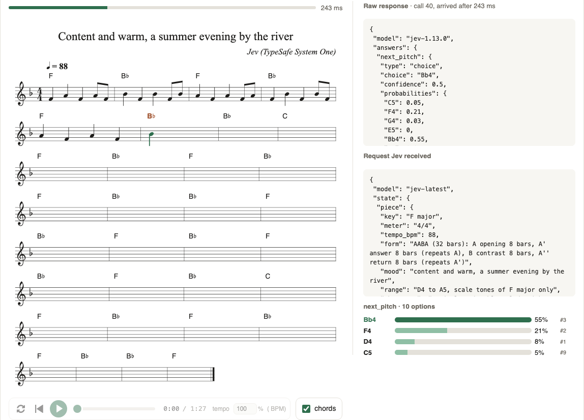
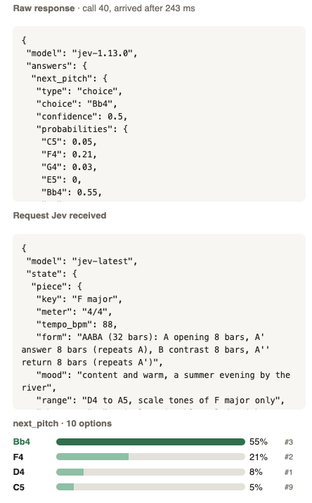
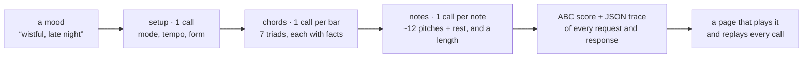

# Jev, the songwriter

**A model that cannot write a single note wrote these songs.**
Jev, TypeSafe AI's decision model, only ever picks one option from a list. So code lays out the bars and the
legal notes, and Jev chooses: which chord, which note, how long. One call per decision, every call recorded,
every song replayable on screen at the speed it was written.

Built with Claude **Fable 5.1** in one afternoon, for fun.

| The replay | Sheet and call, side by side | One call, one answer |
|---|---|---|
|  |  |  |

## Live

- **https://beingcognitive.github.io/jev-songwriter/** — five tunes, each with a score, a player, and
  “Watch it being built in Jev's real time”.

## Five tunes

Each was written from nothing but the mood in its title. Jev chose the mode, the tempo, the form, every chord and
every note; code played the cadences and the repeats.

| | |
|---|---|
| **[Content and warm, a summer evening by the river](https://beingcognitive.github.io/jev-songwriter/demos/demo-river.html?replay=1)** · F major at 100% confidence, 88 bpm, a full AABA  | **[Wistful, late night](https://beingcognitive.github.io/jev-songwriter/demos/live-mood.html?replay=1)** · A minor at 100%, 72 bpm, two long notes a bar  |
| **[Playful, skipping down the street on a spring afternoon](https://beingcognitive.github.io/jev-songwriter/demos/demo-playful-16.html?replay=1)** · G major at 100%, 120 bpm, skipping eighths  | **[Restless, pacing the room at midnight, unable to sleep](https://beingcognitive.github.io/jev-songwriter/demos/demo-restless.html?replay=1)** · E minor at 100%, 140 bpm, and it opens on F♯dim, the one tense chord in the key  |
| **[Tender, rocking a child to sleep](https://beingcognitive.github.io/jev-songwriter/demos/demo-tender.html?replay=1)** · E♭ major, 72 bpm at 95%, two long notes a bar  | |

## The prompt that started it

> Take a quick look at jev-go, only to figure out what Jev is. Jev is good at returning reliable outputs.
> So I think we can use Jev as a songwriter, just for fun.
>
> Nah, I'm not talking about the lyrics. It can generate like `A3-B2-C5-F7`, with length or pause marked.

Then, over the afternoon: *“shouldn't we input the song mood thing to the chord settings?”*, *“Jev writes chord,
melody, chord, melody, like you did, with some repeat?”*, *“It would be fun to re-display how each song was built,
with animation, every time a Jev call succeeds, even reflecting the response time.”*

## How it works



- **Jev never writes.** It receives a state and a question with options, and returns one choice with a probability
  for every option. Code enumerates the legal options and attaches the facts a musician would weigh: interval
  from the last note, chord tone or tension, whether it resolves a leap, how far the cadence is, what a chord does
  right before the cadence. Jev picks. Code plays the pick and asks again.
- **Legal by construction.** Every note is in the key, every bar adds up, every phrase ends on its cadence, a
  repeated phrase repeats. Jev cannot break the song; it can only prefer.
- **One call, verbatim.** The first chord of the restless tune. Code's own ranking put F♯dim last of seven,
  because diminished chords rarely open songs. Jev, reading “restless”, put 42% on it, in 569 ms:

  ```json
  { "choice": "F#dim", "confidence": 0.31,
    "probabilities": { "F#dim": 0.42, "Em": 0.31, "Am": 0.18, "Bm": 0.07, "G": 0.01, "D": 0.01, "C": 0 } }
  ```
- **The replay** rebuilds the sheet decision by decision, each call taking exactly as long as Jev took, with the
  full distribution, the facts behind the pick and the raw response beside the score. A slider and the arrow keys
  step through by hand.
- **Cheap.** About 250 ms and 1,600 input tokens a call; a 32-bar song is 60 to 80 calls, twenty seconds,
  half a cent.

## Second take: what Jev is actually like

The first bridge Jev wrote was seven whole notes. Told, bar after bar, that the previous bar was a single held
note, its probability for holding again climbed from 64% to 94%. A later bridge sat on one chord for five bars.
**Jev's one strong trait is consistency.** So code got three rules about what is *offered*: no whole note in a
phrase's first bar or right after a held bar, no chord root for a third bar in a row, a rest only where every
length on offer fits under a half note. Everything else is Jev's, and the mood does reach the music: minor at 100%
for “wistful”, major at 100% and twice the tempo for “playful”, the diminished chord for “restless”.

The first demos were titled “jazz” and “bossa nova”. Jev did walk ii–V–I in seventh chords for the first and lean
on off-beats for the second, but a title that names a genre promises what a one-line melody cannot deliver, while
a title that names a feeling promises what it visibly does. The genre tunes went; the moods stayed.

## Verification

- 32 tests, all offline on a seeded mock, covering the musical invariants, odd API answers, the CLI, the server
  and the site builder.
- Reviewed three times: one Codex review plus a fan-out of three Codex and three Opus reviewers on the same prompt,
  then two “break the fix” rounds. Severity fell each round; the last found only small things.
- Security-checked before publishing: no secret anywhere in the tree or history, the local server confined to
  `out/` and `docs/` on localhost, all user and API strings escaped on their way into HTML, abcjs pinned to an
  exact version with integrity hashes.

## Run it yourself

Node 22.15+, no dependencies. A TypeSafe API key in the environment or in `.dev.vars` (copy `.dev.vars.example`);
without one a seeded mock plays Jev's part and everything runs offline.

```bash
npm test
npm run compose -- --mood "wistful, late night"          # Jev picks mode, tempo, form, chords, notes
npm run compose -- --mood "a bright pop chorus" --chords "C G Am F" --tempo 120 --form aaba_32
npm run compose -- --mood "triumphant, a fanfare" --order interleaved
npm run serve                                             # http://localhost:3222
```

`--key`, `--mode`, `--tempo`, `--form` (`mini_8`, `short_16`, `aabb_16`, `aaba_32`, `auto`), `--chords` (`jev`,
`fixed`, or a progression), `--order` (`chords-first`, `interleaved`), `--sevenths`, `--seed`, `--title`. With a
mood, anything you do not pass is Jev's to decide. Every run writes `out/<name>.abc`, `.json` (every call) and
`.html` (the page); `npm run site` rebuilds `docs/` from `demos.json`.

## License

MIT. Jev is [TypeSafe AI](https://typesafe.ai)'s model. Scores and audio in the pages come from
[abcjs](https://www.abcjs.net) (MIT), loaded from a CDN at a pinned version.
