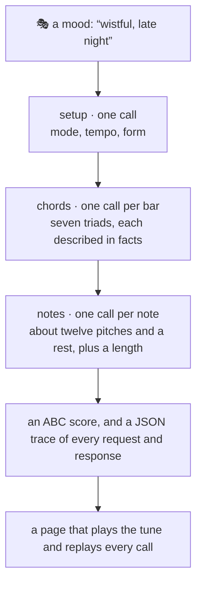

# Jev, the songwriter

**A model that cannot write a single note wrote these songs.**
Jev, TypeSafe AI's decision model, only ever picks one option from a list. So code lays out the bars and the
legal notes, and Jev chooses: which chord, which note, how long. One call per decision, every call recorded,
every song replayable on screen at the speed it was written.

Built with Claude **Fable 5.1** in one afternoon, for fun.

| The replay | Sheet and call, side by side | One call, one answer |
|---|---|---|
|  |  |  |

## Live

- **https://beingcognitive.github.io/jev-songwriter/** — five tunes, each with a score, a player, and
  “Watch it being built in Jev's real time”.

## Five tunes

Each was written from nothing but the mood in its title. Jev chose the mode, the tempo, the form, every chord and
every note; code played the cadences and the repeats. **Click any title to watch the song being written, in Jev's
real time, one call at a time**, with the probabilities and the raw response beside the sheet.

<table>
  <tr>
    <td valign="top" width="50%"><b><a href="https://beingcognitive.github.io/jev-songwriter/demos/demo-river.html?replay=1">Content and warm, a summer evening by the river</a></b><br>F major at 100% confidence, 88 bpm, a full AABA<br><a href="https://beingcognitive.github.io/jev-songwriter/demos/demo-river.html?replay=1">▶ watch it being written · 0:30</a><br><br></td>
    <td valign="top" width="50%"><b><a href="https://beingcognitive.github.io/jev-songwriter/demos/live-mood.html?replay=1">Wistful, late night</a></b><br>A minor at 100%, 72 bpm, two long notes a bar<br><a href="https://beingcognitive.github.io/jev-songwriter/demos/live-mood.html?replay=1">▶ watch it being written · 0:11</a><br><br></td>
  </tr>
  <tr>
    <td valign="top" width="50%"><b><a href="https://beingcognitive.github.io/jev-songwriter/demos/demo-playful-16.html?replay=1">Playful, skipping down the street on a spring afternoon</a></b><br>G major at 100%, 120 bpm, skipping eighths<br><a href="https://beingcognitive.github.io/jev-songwriter/demos/demo-playful-16.html?replay=1">▶ watch it being written · 0:24</a><br><br></td>
    <td valign="top" width="50%"><b><a href="https://beingcognitive.github.io/jev-songwriter/demos/demo-restless.html?replay=1">Restless, pacing the room at midnight, unable to sleep</a></b><br>E minor at 100%, 140 bpm, and it opens on F♯dim, the one tense chord in the key<br><a href="https://beingcognitive.github.io/jev-songwriter/demos/demo-restless.html?replay=1">▶ watch it being written · 0:10</a><br><br></td>
  </tr>
  <tr>
    <td valign="top" width="50%"><b><a href="https://beingcognitive.github.io/jev-songwriter/demos/demo-tender.html?replay=1">Tender, rocking a child to sleep</a></b><br>E♭ major, 72 bpm at 95%, two long notes a bar<br><a href="https://beingcognitive.github.io/jev-songwriter/demos/demo-tender.html?replay=1">▶ watch it being written · 0:12</a><br><br></td>
    <td></td>
  </tr>
</table>

## How it works



- **Jev never writes.** It receives a state and a question with options, and returns one choice with a probability
  for every option. Code enumerates the legal options and attaches the facts a musician would weigh: interval
  from the last note, chord tone or tension, whether it resolves a leap, how far the cadence is, what a chord does
  right before the cadence. Jev picks. Code plays the pick and asks again.
- **Legal by construction.** Every note is in the key, every bar adds up, every phrase ends on its cadence, a
  repeated phrase repeats. Jev cannot break the song; it can only prefer.
- **One call, verbatim.** The first chord of the restless tune. Code's own ranking put F♯dim last of seven,
  because diminished chords rarely open songs. Jev, reading “restless”, put 42% on it, in 569 ms:

  ```json
  { "choice": "F#dim", "confidence": 0.31,
    "probabilities": { "F#dim": 0.42, "Em": 0.31, "Am": 0.18, "Bm": 0.07, "G": 0.01, "D": 0.01, "C": 0 } }
  ```
- **The replay** rebuilds the sheet decision by decision, each call taking exactly as long as Jev took, with the
  full distribution, the facts behind the pick and the raw response beside the score. A slider and the arrow keys
  step through by hand.
- **Cheap.** About 250 ms and 1,600 input tokens a call; a 32-bar song is 60 to 80 calls, twenty seconds,
  half a cent.

## Run it yourself

Node 22.15+, no dependencies. A TypeSafe API key in the environment or in `.dev.vars` (copy `.dev.vars.example`);
without one a seeded mock plays Jev's part and everything runs offline.

```bash
npm test
npm run compose -- --mood "wistful, late night"          # Jev picks mode, tempo, form, chords, notes
npm run compose -- --mood "a bright pop chorus" --chords "C G Am F" --tempo 120 --form aaba_32
npm run compose -- --mood "triumphant, a fanfare" --order interleaved
npm run serve                                             # http://localhost:3222
```

`--key`, `--mode`, `--tempo`, `--form` (`mini_8`, `short_16`, `aabb_16`, `aaba_32`, `auto`), `--chords` (`jev`,
`fixed`, or a progression), `--order` (`chords-first`, `interleaved`), `--sevenths`, `--seed`, `--title`. With a
mood, anything you do not pass is Jev's to decide. Every run writes `out/<name>.abc`, `.json` (every call) and
`.html` (the page); `npm run site` rebuilds `docs/` from `demos.json`.

## License

MIT. Jev is [TypeSafe AI](https://typesafe.ai)'s model. Scores and audio in the pages come from
[abcjs](https://www.abcjs.net) (MIT), loaded from a CDN at a pinned version.
